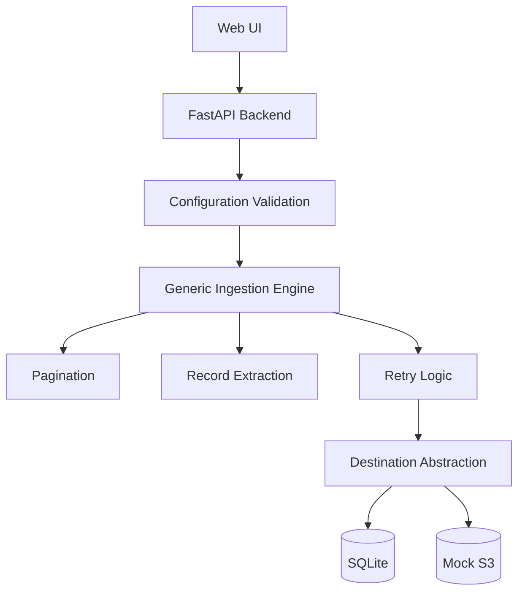

# Generic Data Ingestion Service – Design Notes

## Problem Statement

The objective was to build a generic data ingestion framework capable of ingesting data from arbitrary REST APIs without being rewritten for each new source. Rather than targeting a specific provider (e.g., Amazon or Walmart), the system is configuration-driven so that new APIs can be integrated by supplying configuration instead of modifying application logic.

---

## Design Goals

The project was designed around the following principles:

- Generic rather than API-specific
- Configuration over code changes
- Extensible architecture
- Separation of concerns
- Production-oriented design within a two-day implementation window

---

## Architecture

The system consists of five major components.

---

## Key Design Decisions

### 1. Configuration-Driven Architecture
The ingestion engine never contains source-specific logic.
Instead, every source is described through configuration:
- endpoint
- pagination strategy
- record extraction path
- destination

Adding a new REST API requires configuration changes only.

### 2. Pagination Abstraction
Different APIs paginate differently.
The framework supports:
- None
- Page
- Offset
- Cursor
- Next-Link

The ingestion engine delegates pagination entirely to configuration instead of hardcoding provider-specific loops.

### 3. Destination Abstraction
Persistence is separated from ingestion.
Current implementations:
- SQLite
- Mock S3

Future destinations can be added without changing the ingestion engine.
Examples:
- AWS S3
- Kafka
- Google Cloud Storage

### 4. Raw JSON Persistence
Instead of transforming records during ingestion, raw JSON payloads are stored.
Benefits:
- Prevents information loss
- Handles heterogeneous schemas
- Enables downstream transformations

### 5. Retry Strategy
Transient HTTP failures are handled using exponential backoff retries.
This improves resilience against temporary network failures.

### 6. Validation
Configuration is validated before ingestion begins.
Invalid pagination types or malformed requests fail immediately without creating ingestion work.

### 7. Job Tracking
Every ingestion job records:
- status
- timestamps
- pages fetched
- records stored
- error messages

This provides operational visibility.

---

## Trade-offs

The implementation intentionally prioritizes architecture over infrastructure.

| Current | Production |
|----------|------------|
| SQLite | PostgreSQL |
| ThreadPoolExecutor | Celery / Airflow |
| Local Files | AWS S3 |
| Static Headers | OAuth2 / AWS SigV4 |

These choices reduce setup complexity while preserving extensibility.

---

## Assumptions

- APIs return JSON.
- Pagination behavior is described through configuration.
- Public APIs remain available during execution.
- Authentication headers can be supplied through configuration.

---

## Production Considerations

If evolving into production, the next engineering priorities would be:
- Idempotent ingestion
- Mid-job checkpointing
- Retry-After support for HTTP 429
- OAuth2 / AWS SigV4 authentication
- PostgreSQL
- Distributed workers
- Metrics and observability
- Schema drift detection

These were intentionally deferred due to the two-day project scope.

---

## Conclusion

The primary objective of this project was not to build an Amazon-specific connector but to demonstrate a generic ingestion architecture capable of adapting to arbitrary REST APIs through configuration. The implementation emphasizes extensibility, maintainability, and separation of concerns while remaining lightweight enough to evaluate easily.
