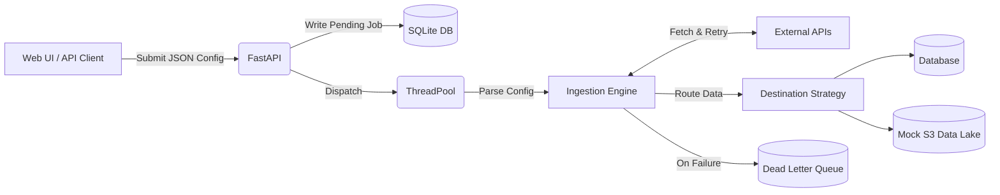

# Generic Data Ingestion Service

## 1. Project Overview
**Generic Data Ingestion Service** is a configuration-driven ingestion framework that connects to arbitrary REST APIs, retrieves JSON data, and persists it to configurable destinations without requiring source-specific code changes. The system demonstrates extensibility through pluggable pagination strategies, destination abstractions, retry logic, and job tracking.

## 2. Features
- **Generic configuration-driven ingestion:** No hardcoded schemas.
- **Multiple concurrent APIs:** Ingests multiple APIs simultaneously via ThreadPool workers.
- **Multiple pagination strategies:** Supports Cursor, Offset, Page, Next Links, and Auto-detection.
- **Raw JSON persistence:** Stores payloads exactly as received to prevent fragile schema-drift failures.
- **Retry with exponential backoff:** Resilient to network flakes.
- **SQLite destination:** Relational storage strategy.
- **Mock S3 destination:** Object storage strategy.
- **Dead Letter Queue (DLQ):** Failed records are routed to an isolated error table without crashing the job.
- **Incremental sync:** Persists cursors so subsequent runs resume where they left off.
- **Job tracking:** A lightweight web UI to submit and poll job statuses dynamically.

## 3. Architecture


## 4. Key Design Decisions
- **Configuration-driven architecture:** New APIs are integrated through configuration rather than code changes.
- **Pagination abstraction:** Supports multiple pagination strategies through configuration.
- **Destination abstraction:** Persistence is decoupled from ingestion, allowing new storage backends to be plugged in trivially.
- **Raw JSON persistence:** Payloads are stored without transformation to preserve source fidelity.
- **Retry strategy:** Transient failures are handled with retries and exponential backoff (`tenacity`).
- **Job tracking:** Each ingestion records status, timestamps, pages fetched, records stored, and isolated errors.

## 5. Supported Pagination
| Pagination Strategy | Supported |
| --- | --- |
| None | ✅ |
| Page | ✅ |
| Offset | ✅ |
| Cursor | ✅ |
| Next Link | ✅ |
| Auto | ✅ |

## 6. Public APIs Demonstrated
| API | Structure | Pagination | Demo Result |
| --- | --- | --- | --- |
| **JSONPlaceholder Posts** | Flat JSON Array | None | ✅ 100 records |
| **Rick & Morty Characters** | Nested (`results`) | Next Link | ✅ 40 records |
| **DummyJSON Products** | Nested (`products`) | Offset | ✅ 60 records |
| **Open Brewery** | Flat Array | Page | ✅ Successful |

## 7. Running the Project
**Requirements:** Docker (Recommended) or Python 3.11+

**Using Docker (Single Command):**
```bash
docker compose up --build
```

**Using Python (Local Development):**
```bash
python -m venv .venv
.\.venv\Scripts\activate
pip install -r requirements.txt
uvicorn app:app --reload
```

**How to test:**
- Open `http://127.0.0.1:8000` in your browser.
- Paste one of the example configurations (or click "Load Demo").
- Click "Start Ingestion".
- Observe the job progress updating dynamically on the dashboard.

## 8. Validation
More than **20 functional and failure scenarios** were manually validated.
Please refer to **[TEST_RESULTS.md](./TEST_RESULTS.md)** for a full matrix of validated scenarios, failure modes, and database verifications.

## 9. Production Readiness
The architecture intentionally separates ingestion, pagination, persistence, and configuration so the core ingestion engine remains unchanged while infrastructure components evolve.

| Current Implementation | Future Production Evolution |
|---|---|
| **SQLite Database** | PostgreSQL / Snowflake |
| **ThreadPoolExecutor** | Celery / Airflow / AWS SQS |
| **Local File System (Mock S3)**| AWS S3 / Kafka / GCP Cloud Storage |
| **Static Auth Headers** | Enterprise Auth Providers (OAuth2, AWS SigV4) |

## 10. Trade-offs & Assumptions
**Trade-offs:**
- SQLite was chosen instead of PostgreSQL to keep setup simple and avoid heavy Docker images for reviewers.
- ThreadPoolExecutor was chosen instead of Celery to avoid requiring Redis/RabbitMQ infrastructure for this demo.
- Public APIs were used for demonstration because enterprise APIs require complex credential handshakes.
- The framework currently targets JSON REST APIs (skipping XML/CSV).

**Assumptions:**
- APIs return valid JSON payloads.
- The JSON configuration provided correctly describes the API's pagination rules.
- Network connectivity is available.
- Authentication headers can be provided manually through configuration.

## 11. Future Work
If given more time to scale this for an enterprise production environment (like Walmart or Amazon), these engineering improvements would be prioritized:
- **OAuth2 / AWS SigV4:** Native support for complex credential handshakes.
- **Idempotent Ingestion:** Record hashing to prevent duplicates on rerun.
- **Schema Drift Detection:** Alerting when APIs silently change their payload keys.
- **Rate Limit Awareness:** Support for HTTP 429 `Retry-After` headers.
- **Prometheus Metrics & `/health` endpoint:** For Datadog/Pagerduty observability.

## 12. AI Usage
AI tools (ChatGPT and Gemini) were used to accelerate boilerplate generation, documentation drafting, and brainstorming. All generated code was reviewed, manually tested, and refined through extensive validation.

**One place AI got something wrong:**
Early on, the AI naively assumed that all paginated APIs return `next` links solely within the JSON response body. I discovered through testing that many enterprise APIs (like GitHub) actually return pagination links hidden inside the HTTP Headers (e.g., `Link: <url>; rel="next"`). I caught this oversight, replaced the naive implementation, and explicitly instructed the engine to parse `response.headers` for `rel="next"` links before falling back to the JSON body. This proves the importance of validating AI assumptions against real-world production behaviors.
