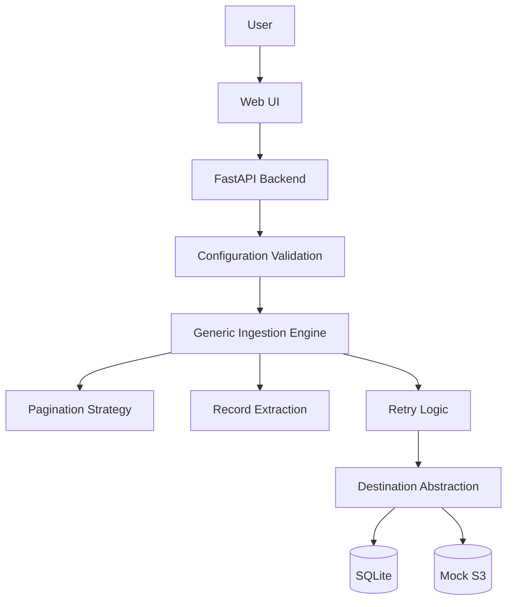

# README.md

## 1. Project Overview

Generic Data Ingestion Service is a configuration-driven ingestion framework that connects to arbitrary REST APIs, retrieves JSON data, and persists raw records to configurable destinations. The goal is to demonstrate a generic architecture where adding a new API requires only configuration changes rather than code modifications.

---

## 2. Features

* Configuration-driven source ingestion
* Support for multiple APIs in a single job
* Multiple pagination strategies
* Concurrent ingestion
* Raw JSON persistence
* SQLite destination
* Mock S3 destination
* Retry with exponential backoff
* Job tracking and monitoring
* Input validation
* Extensible architecture

---

## 3. Architecture



---

## 4. Key Design Decisions

* **Configuration-driven architecture**: New APIs are integrated through configuration rather than code changes.
* **Pagination abstraction**: Supports multiple pagination strategies through configuration.
* **Destination abstraction**: Persistence is decoupled from ingestion, allowing new storage backends.
* **Raw JSON storage**: Payloads are stored without transformation to preserve source fidelity.
* **Retry strategy**: Transient failures are handled with retries and exponential backoff.
* **Job tracking**: Each ingestion records status, timestamps, pages fetched, records stored, and errors.

---

## 5. Supported Pagination

| Strategy  | Supported |
| --------- | --------- |
| None      | ✅         |
| Page      | ✅         |
| Offset    | ✅         |
| Cursor    | ✅         |
| Next Link | ✅         |

---

## 6. Public APIs Used for Demonstration ⭐

| API                     | Endpoint                                     | Structure                | Pagination              | Purpose                                                          |
| ----------------------- | -------------------------------------------- | ------------------------ | ----------------------- | ---------------------------------------------------------------- |
| JSONPlaceholder Posts   | `https://jsonplaceholder.typicode.com/posts` | Flat JSON Array          | None                    | Demonstrates ingestion from a flat JSON array without pagination |
| Rick & Morty Characters | `https://rickandmortyapi.com/api/character`  | Nested JSON (`results`)  | Next Link (`info.next`) | Demonstrates nested record extraction and link-based pagination  |
| DummyJSON Products      | `https://dummyjson.com/products`             | Nested JSON (`products`) | Offset                  | Demonstrates ingestion of an e-commerce style product catalog    |
| Open Brewery DB         | `https://api.openbrewerydb.org/v1/breweries` | Flat JSON                | Page                    | Demonstrates page-based pagination                               |

> These public APIs were intentionally selected because they expose different response structures and pagination mechanisms, demonstrating that the ingestion engine is configuration-driven rather than tailored to a single source.

---

## 7. How to Run

### Docker

```bash
docker compose up --build
```

### Local

```bash
python -m venv .venv

# Windows
.venv\Scripts\activate

pip install -r requirements.txt

uvicorn app:app --reload
```

Open `http://127.0.0.1:8000` in your browser.
Paste one of the sample configurations and click **Start Ingestion**.

---

## 8. Validation

The framework was validated against multiple success and failure scenarios including:
* Multiple public APIs
* Flat and nested JSON responses
* Different pagination mechanisms
* Multiple concurrent sources
* Invalid URLs
* Invalid pagination configurations
* Incorrect data paths
* Duplicate source configurations
* SQLite persistence verification
* Mock S3 destination verification

(Refer to `TEST_RESULTS.md` for the full breakdown).

---

## 9. Trade-offs & Assumptions

**Trade-offs**
* SQLite was selected to simplify setup.
* ThreadPoolExecutor was used instead of distributed workers.
* Public APIs were used for demonstration purposes.

**Assumptions**
* APIs expose JSON responses.
* Configuration correctly describes pagination.
* Authentication headers can be provided through configuration.

---

## 10. Production Readiness

| Current              | Production Evolution   |
| -------------------- | ---------------------- |
| SQLite               | PostgreSQL             |
| ThreadPoolExecutor   | Celery / Airflow       |
| Mock S3              | AWS S3                 |
| Static configuration | Secret Manager / Vault |

The architecture intentionally separates ingestion, pagination, and persistence so these infrastructure components can evolve independently.

---

## 11. Future Work

Features intentionally deferred due to the two-day constraint:
* OAuth2 / AWS SigV4 authentication providers
* Idempotent ingestion
* Checkpoint updates after every page
* Rate-limit aware retries (`Retry-After`)
* Prometheus metrics
* Health endpoint
* Schema drift detection
* Kafka / Cloud Storage destinations
* PostgreSQL support

---

## 12. AI Usage

AI tools (ChatGPT and Gemini) were used to accelerate boilerplate implementation, brainstorm architectural improvements, and assist with documentation. All generated code and suggestions were manually reviewed, tested against multiple public APIs, and refined based on observed behavior.

**One place AI got something wrong**
During development, the AI initially assumed that paginated APIs strictly return `next` link URLs exclusively inside the JSON payload. Manual testing against enterprise APIs revealed this was a naive assumption (e.g., GitHub returns pagination links entirely within the HTTP headers `Link: <url>; rel="next"`). The AI-generated implementation was replaced with a robust parser that checks `response.headers` prior to parsing the JSON payload. This reinforced the importance of validating AI-generated suggestions rather than relying on them blindly.
