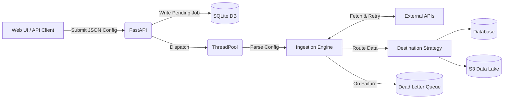

# Generic Data Ingestion Service

## 1. Project Overview
This project solves the problem of building a unified, scalable data pipeline capable of ingesting JSON payloads from thousands of wildly different third-party APIs without requiring custom code for each one. 

By utilizing a strictly **configuration-driven architecture**, this Python/FastAPI service allows engineers to dynamically define the structural paths, authentication, and pagination styles of any external API via JSON. The engine reads the configuration, fetches the data, normalizes it into raw JSON records, and routes it to an extensible storage destination.

## 2. Features
- **Generic Configuration-Driven Ingestion:** No hardcoded schemas.
- **Multiple Concurrent APIs:** Ingests multiple APIs simultaneously via ThreadPool workers.
- **Multiple Pagination Strategies:** Supports Cursor, Offset, Page, Next Links, and Auto-detection.
- **Raw JSON Persistence:** Stores payloads exactly as received to prevent fragile schema-drift failures.
- **Retry with Exponential Backoff:** Resilient to network flakes.
- **Extensible Destinations:** Includes `SQLite` (Database) and `Mock S3` (Object Storage) destinations.
- **Dead Letter Queue (DLQ):** Failed records are routed to an isolated error table without crashing the job.
- **Incremental Sync (State Tracking):** Persists cursors so subsequent runs resume where they left off.
- **Live Job Tracking:** A lightweight web UI to submit and poll job statuses dynamically.

## 3. Architecture
*(A detailed breakdown of architectural decisions, trade-offs, and scaling plans can be found in [DESIGN.md](./DESIGN.md))*



## 4. Supported Pagination
| Type | Supported |
|---|---|
| None | ✅ |
| Page | ✅ |
| Offset | ✅ |
| Cursor | ✅ |
| Next Link | ✅ |
| Auto | ✅ |

## 5. Public APIs Demonstrated
| API | Structure | Pagination |
|---|---|---|
| **JSONPlaceholder** | Flat array | None |
| **Rick & Morty** | Nested (`results`) | Next Link (`info.next`) |
| **DummyJSON** | Nested | Offset |
| **Open Brewery** | Flat | Page |

## 6. Running the Project
**Requirements:** Docker (Recommended) or Python 3.11+

**Using Docker (Single Command):**
```bash
docker compose up --build
```

**Using Python (Local Development):**
```bash
python -m venv .venv
.\.venv\Scripts\activate
pip install -r requirements.txt
uvicorn app:app --reload
```

**Expected Output:**
The API and Web Dashboard will be instantly accessible at `http://127.0.0.1:8000`.

## 7. Validation
Extensive manual testing and edge-case validation has been performed to prove this system is generic. 
Please refer to **[TEST_RESULTS.md](./TEST_RESULTS.md)** for a full matrix of validated scenarios, failure modes, and database verifications.

## 8. Production Readiness
This project was strictly bounded to a two-day timeframe. If deploying to production, the underlying infrastructure must evolve while the core code logic remains identical:

| Current Implementation | Future Production Infrastructure |
|---|---|
| **SQLite Database** | PostgreSQL / Snowflake |
| **ThreadPoolExecutor** | Celery / Airflow / AWS SQS |
| **Local File System (Mock S3)**| AWS S3 / Kafka / GCP Cloud Storage |
| **Static Auth Headers** | Enterprise Auth Providers (OAuth2, AWS SigV4) |

## 9. AI Usage
AI tools (ChatGPT and Gemini) were used to accelerate boilerplate generation (FastAPI routing), documentation drafting, and brainstorming. All generated code was heavily reviewed, manually tested, and refined through extensive validation.

**Where the AI got it wrong:** 
Early on, the AI naively assumed that all paginated APIs return `next` links solely within the JSON response body. I discovered through testing that many enterprise APIs (like GitHub) actually return pagination links hidden inside the HTTP Headers (e.g., `Link: <url>; rel="next"`). I caught this oversight, replaced the naive implementation, and explicitly instructed the engine to parse `response.headers` for `rel="next"` links before falling back to the JSON body. 

## 10. Future Work
If we were to scale this platform for enterprise usage (e.g., Amazon, Walmart), our immediate engineering priorities would be:
- **Idempotent Ingestion:** Generating stable hashes for records to prevent duplicates during re-runs.
- **Mid-page Checkpointing:** Persisting state after every single page instead of at the end of the run.
- **429 Rate Limiter / Adaptive Backoff:** Reading `Retry-After` headers to gracefully pause ingestion.
- **Schema Drift Detection:** Alerting when downstream APIs silently change field names.
- **Metrics / `/health` endpoints:** Exposing structured JSON logs and Prometheus metrics for datadog/pagerduty.
